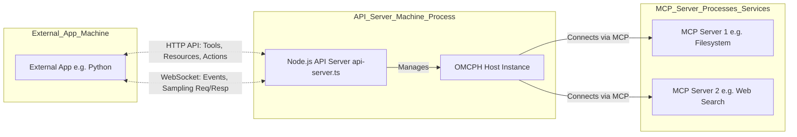
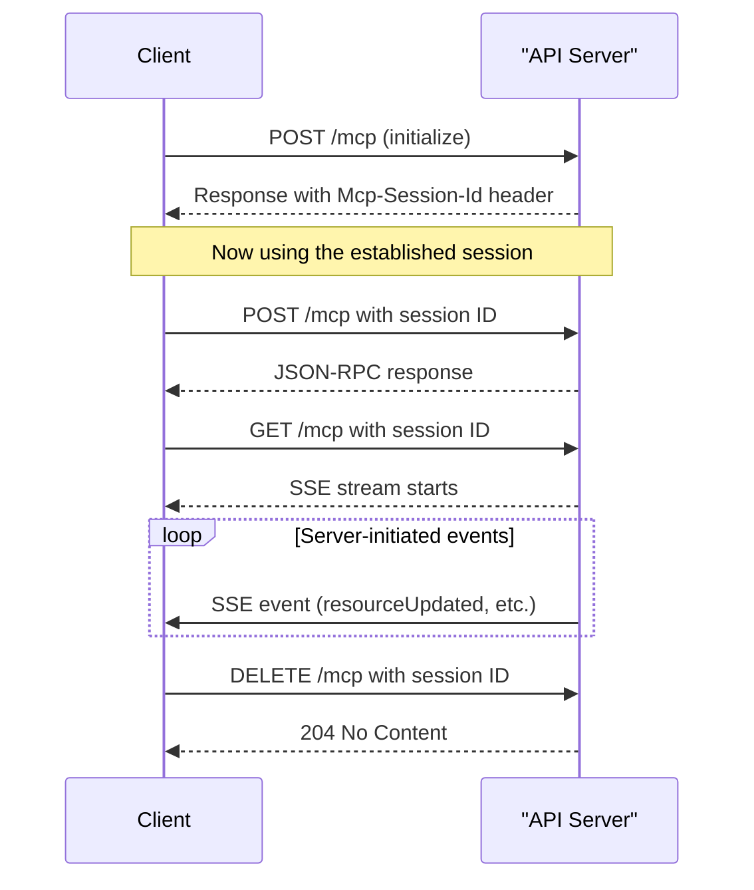

# OMCPH API Server Documentation

This document describes the optional API server built on top of the core `OMCPH` client host library.

## Purpose

The primary reason to use this API server is to **allow applications written in languages other than TypeScript/JavaScript (e.g., Python, Go, Java, C#) to interact with MCP servers through the `OMCPH` host**.

If your main application _is_ written in TypeScript or JavaScript, you should use the `McpClientHost` library **directly** within your application (see the [Core Library Documentation](./OMCPH.md)) and **do not** need to run this separate API server.

## Architecture

When you run the API server:

1.  It instantiates the core `McpClientHost` from the `OMCPH` library.
2.  The `McpClientHost` connects to and manages the configured external MCP Servers (via stdio, sse, websocket).
3.  The API server exposes HTTP endpoints for your external application to query capabilities (tools, resources, etc.) and trigger actions (call tools, read resources).
4.  It uses a WebSocket connection for:
    - Sending real-time events (like `serverConnected`, `capabilitiesUpdated`) _from_ the API server _to_ your external application.
    - Handling the `samplingRequest` flow: When an MCP server asks the host to make an LLM call, the API server forwards this request over the WebSocket _to_ your external application. Your application performs the LLM call and sends the result _back_ over the WebSocket.



## Setup & Running

### Prerequisites

- Node.js (version 18 or higher recommended)
- npm
- A clone of the `OMCPH` repository.

### Installation

Navigate to your cloned `OMCPH` repository directory and install dependencies:

```bash
# In your cloned OMCPH directory
npm install
```

### Configuration

There are two recommended ways to configure the API server:

#### Method 1: Environment Variables and .env File

1. **Create a `.env` file:** Copy the template from `src/api/.env.example` to `src/api/.env`
2. **Configure the server** by setting values for:
   - `OMCPH_API_PORT` - The port to run the server on (default: 3000)
   - `OMCPH_CONFIG_PATH` - Path to the JSON config file (see Method 2)
   - `OMCPH_API_KEYS` - Comma-separated list of API keys for authentication
   - `OMCPH_AUTH_REQUIRED` - Set to "false" to disable authentication
   - `OMCPH_SAMPLING_TIMEOUT_MS` - Timeout in ms for sampling requests

#### Method 2: JSON Configuration File

1. **Create a config file:** Copy the template from `src/api/config-example.json` to a location of your choice
2. **Edit the file** to define:
   - `hostInfo` - Information about your host
   - `hostCapabilities` - Capabilities your host supports
   - `servers` - Array of server configurations to connect to

Example configuration file:

```json
{
  "hostInfo": {
    "name": "My Python App MCP Bridge",
    "version": "1.0.0"
  },
  "hostCapabilities": {
    "sampling": {},
    "roots": { "listChanged": true }
  },
  "servers": [
    {
      "id": "filesystem",
      "name": "Filesystem Server",
      "transport": "stdio",
      "command": "npx",
      "args": [
        "-y",
        "@modelcontextprotocol/server-filesystem",
        "/path/to/files"
      ]
    },
    {
      "id": "tools",
      "name": "Tools Server",
      "transport": "websocket",
      "url": "ws://localhost:3001/mcp"
    }
  ]
}
```

3. **Set the path** to this file using the `OMCPH_CONFIG_PATH` environment variable

> **Note:** Even when using a JSON configuration file, the API server will still check for other environment variables like `OMCPH_API_KEYS` for authentication.

### Running

- **Using npx (easiest):**

  ```bash
  # Run directly using npx (after installing the package globally or in your project)
  npx omcph-api-server

  # With environment variables
  OMCPH_API_PORT=3005 OMCPH_CONFIG_PATH=./config.json npx omcph-api-server
  ```

- **Development (with auto-restart on changes using `ts-node`):**
  ```bash
  npm run dev:api
  ```
- **Production:**

1.  Build the TypeScript code:
    ```bash
    npm run build
    ```
2.  Run the compiled server:
    ```bash
    npm run start:api
    # or directly: node dist/esm/api/api-server.js
    ```
    Consider using a process manager like `pm2` (`pm2 start dist/esm/api/api-server.js --name omcph-api`) for production deployments.

- **Port:** The server listens on port `3000` by default. Change this by setting the `OMCPH_API_PORT` environment variable (e.g., `OMCPH_API_PORT=3005 npm run start:api`).

## HTTP API Endpoints

All successful responses are JSON. Errors return appropriate HTTP status codes (4xx, 5xx) with a JSON body like:
`{ "error": "<error_code>", "message": "<description>", "code": <mcp_error_code?>, "data": <mcp_error_data?> }`.

| Method | Path                                      | Description                                                 | Request Body (Content-Type: application/json)                  | Success Response Body (JSON matching MCP SDK types) |
| :----- | :---------------------------------------- | :---------------------------------------------------------- | :------------------------------------------------------------- | :-------------------------------------------------- |
| `GET`  | `/status`                                 | Get API server status, host info, and connected server IDs. | -                                                              | `{ status, hostInfo, connectedServers }`            |
| `GET`  | `/servers`                                | Get a list of currently connected server IDs.               | -                                                              | `{ connectedServers: ["id1", "id2"] }`              |
| `GET`  | `/capabilities/tools`                     | Get aggregated list of available tools.                     | -                                                              | `AggregatedTool[]`                                  |
| `GET`  | `/capabilities/resources`                 | Get aggregated list of available concrete resources.        | -                                                              | `AggregatedResource[]`                              |
| `GET`  | `/capabilities/templates`                 | Get aggregated list of available resource templates.        | -                                                              | `AggregatedResourceTemplate[]`                      |
| `GET`  | `/capabilities/prompts`                   | Get aggregated list of available prompts.                   | -                                                              | `AggregatedPrompt[]`                                |
| `GET`  | `/suggest/resource`                       | Suggest servers for handling a specific resource URI.       | -                                                              | `string[]` (array of server IDs by relevance)       |
| `GET`  | `/suggest/tool`                           | Suggest servers for handling a specific tool.               | -                                                              | `string[]` (array of server IDs by relevance)       |
| `GET`  | `/suggest/prompt`                         | Suggest servers for handling a specific prompt.             | -                                                              | `string[]` (array of server IDs by relevance)       |
| `GET`  | `/config/roots`                           | Get the currently configured workspace roots.               | -                                                              | `Root[]`                                            |
| `POST` | `/servers/:serverId/tools/:toolName/call` | Execute a specific tool on a specific server.               | Tool arguments object (e.g., `{ "query": "..." }` or `{}`).    | `CallToolResult`                                    |
| `POST` | `/servers/:serverId/resource/read`        | Read a specific resource from a specific server.            | `{ "uri": "resource-uri-string" }`                             | `ReadResourceResult`                                |
| `POST` | `/servers/:serverId/prompt/get`           | Get a specific prompt instance from a specific server.      | `{ "name": "prompt-name", "arguments": { ... }? }`             | `GetPromptResult`                                   |
| `POST` | `/config/roots`                           | Set the workspace roots for capable MCP servers.            | `Root[]` (e.g., `[{ "uri": "file:///path", "name": "Proj" }]`) | `200 OK` with `{ "message": "Roots updated..." }`   |

## WebSocket API

The WebSocket connection enables real-time communication, primarily for **events** sent _from_ the API server _to_ your application, and for handling the **sampling flow**.

- **Endpoint:** `ws://<your-api-server-host>:<port>/ws` (e.g., `ws://localhost:3000/ws`)

### Subscription System

The API server now implements a subscription system that allows clients to control which events they receive. To use this feature:

1. Connect to the WebSocket endpoint
2. Send subscription messages to opt-in to specific event types:

```json
{
  "type": "subscribe",
  "topic": "resources" // Or any other valid topic
}
```

Available subscription topics:

- `"resources"`: All resource updated events
- `"resource:<uri>"`: Events for a specific resource URI
- `"server:<serverId>"`: All events from a specific server

You can unsubscribe from a topic by sending:

```json
{
  "type": "unsubscribe",
  "topic": "resources" // The topic to unsubscribe from
}
```

### Server-to-Client Messages (Events)

Your application (e.g., Python client) should listen for these JSON message types received over the WebSocket:

- `{ "type": "capabilities_updated" }`: Sent when the aggregated list of tools, resources, or prompts changes. Your app should likely re-fetch relevant capabilities via the HTTP API (e.g., `GET /capabilities/tools`).
- `{ "type": "server_connected", "serverId": "..." }`: Sent when an MCP server successfully connects and initializes.
- `{ "type": "server_disconnected", "serverId": "...", "error": { "message": "..." } | null }`: Sent when an MCP server disconnects. `error` is present if the disconnection was not clean.
- `{ "type": "resource_updated", "serverId": "...", "uri": "..." }`: Sent when a resource is updated on a server. Only received if subscribed to the appropriate topic.
- `{ "type": "log", "level": "...", "message": "...", "data": ... }`: Forwards logs from the OMCPH host and connected MCP servers.
- `{ "type": "sampling_request", "requestId": "<unique-id>", "serverId": "...", "params": { ... } }`: **CRITICAL.** This message is sent when an MCP server connected to the host requests an LLM call. `params` contains the full `CreateMessageRequest['params']` object (messages, model preferences, etc.). Your application **MUST** handle this message (see Sampling Flow below).

### Client-to-Server Messages (Sampling Response)

Your application (e.g., Python client) **MUST** send one of the following JSON messages back over the _same WebSocket connection_ in response to a `sampling_request` message received from the API server:

1.  **On Success:**

    ```json
    {
      "type": "sampling_response",
      "requestId": "<the_original_requestId_from_sampling_request>",
      "result": {
        // Structure MUST match CreateMessageResult from MCP types
        "model": "model-name-your-app-used", // *Required
        "role": "assistant", // *Required (must be 'assistant')
        "content": {
          "type": "text",
          "text": "The actual LLM response text..."
        }, // *Required (Text or Image)
        "stopReason": "endTurn", // *Required (e.g., endTurn, maxTokens)
        "usage": {
          // Optional
          "promptTokens": 10,
          "completionTokens": 20,
          "totalTokens": 30
        }
      }
    }
    ```

2.  **On Failure:**
    ```json
    {
      "type": "sampling_error",
      "requestId": "<the_original_requestId_from_sampling_request>",
      "error": {
        // Use MCP Error Codes (https://modelcontextprotocol.io/specification/json-rpc/#error-codes)
        "code": -32603, // Internal Error (recommended for general LLM/API failures)
        "message": "Specific error message (e.g., LLM API call failed: Rate limit exceeded)"
        // "data": { ... } // Optional additional structured error info
      }
    }
    ```

### Sampling Flow Explained

1.  An external MCP Server (e.g., `FilesystemServer`) sends a `sampling/createMessage` request to the `OMCPH` host running inside the API server process.
2.  The `OMCPH` host emits the `samplingRequest` event internally.
3.  The `api-server.ts` code listens for this event, generates a unique `requestId`, stores the internal callback needed to reply to the MCP Server, and starts a timeout.
4.  The API server sends a `sampling_request` message (including the `requestId` and original request `params`) over the WebSocket to your connected external application (e.g., Python).
5.  Your external application receives the `sampling_request` message.
6.  It extracts the `params` and uses its **own logic and API keys** to make the actual call to the desired LLM (e.g., call Anthropic, OpenAI, etc.).
7.  **If the LLM call succeeds:** Your external app formats the LLM response into the `CreateMessageResult` structure and sends a `sampling_response` message (including the original `requestId`) back via WebSocket.
8.  **If the LLM call fails:** Your external app creates an error object (with `code`, `message`) and sends a `sampling_error` message (including the original `requestId`) back via WebSocket.
9.  The `api-server.ts` receives the `sampling_response` or `sampling_error` message.
10. It looks up the pending request by `requestId`, cancels the timeout, and calls the stored internal callback with the received result or a reconstructed `McpError`.
11. The `OMCPH` host relays this final result/error back to the originating MCP Server.

**Timeout:** If your external application fails to send a `sampling_response` or `sampling_error` back within the timeout period (**default 60 seconds**, defined by `SAMPLING_REQUEST_TIMEOUT_MS` in `api-server.ts`), the API server will automatically call the internal callback with a timeout `McpError` (code `ErrorCode.RequestTimeout`), which gets relayed back to the originating MCP Server.

### Conceptual Python WebSocket Client Snippet

```python
# Conceptual Python WebSocket client interacting with the OMCPH API Server
import websocket # Requires `pip install websocket-client`
import json
import threading
import time
import requests # Requires `pip install requests`

API_BASE_URL = "http://localhost:3000" # Adjust if needed
API_WS_URL = "ws://localhost:3000/ws"  # Note the /ws path for WebSocket
API_KEY = "your-api-key-here"  # If authentication is enabled

# --- Replace this with your actual LLM call ---
# This function MUST return a dictionary matching the structure
# expected by the 'result' field in the 'sampling_response' message.
# See the CreateMessageResult schema in the MCP specification.
def call_your_applications_llm(mcp_params):
    print(f"PYTHON: Received sampling request. Simulating LLM call...")
    print(f"PYTHON: LLM Input Messages: {mcp_params.get('messages')}")
    time.sleep(0.5) # Simulate network latency
    # Simulate a successful response structure matching CreateMessageResult
    return {
        "model": "my-powerful-llm-v2", # *Required
        "role": "assistant", # *Required
        "content": {"type": "text", "text": f"Response based on {len(mcp_params.get('messages', []))} messages."}, # *Required
        "stopReason": "endTurn" # *Required
        # "usage": { ... } # Optional
    }
    # Or simulate an error:
    # raise ValueError("Simulated LLM API failure!")
# --- End LLM call replacement ---

class ApiClient:
    def __init__(self):
        self.ws = None
        self.ws_thread = None
        self.is_connected = False
        self.connection_id = None
        self.session = requests.Session() # Use session for potential connection reuse
        self.subscriptions = set()
        self.sampling_requests = {}

    def _on_message(self, ws, message):
        try:
            data = json.loads(message)
            event_type = data.get("type")
            # print(f"PYTHON WS Received: Type={event_type}") # Verbose

            if event_type == "connection":
                self.connection_id = data.get("connectionId")
                print(f"PYTHON: Connected to WebSocket server. Connection ID: {self.connection_id}")
                # Subscribe to events we're interested in
                self._subscribe_to_topics()

            elif event_type == "sampling_request":
                request_id = data.get("requestId")
                server_id = data.get("serverId")
                params = data.get("params") # These are CreateMessageRequest['params']

                if request_id and params:
                    print(f"PYTHON: Handling sampling request {request_id} from {server_id}...")
                    try:
                        llm_result = call_your_applications_llm(params)
                        response = {
                            "type": "sampling_response",
                            "requestId": request_id,
                            "result": llm_result # Must match CreateMessageResult structure
                        }
                        ws.send(json.dumps(response))
                        print(f"PYTHON: Sent sampling_response for {request_id}")
                    except Exception as e:
                        print(f"PYTHON: Error during LLM call: {e}")
                        error_response = {
                            "type": "sampling_error",
                            "requestId": request_id,
                            "error": { "code": -32603, "message": f"LLM Error: {e}" } # MCP InternalError
                        }
                        ws.send(json.dumps(error_response))
                        print(f"PYTHON: Sent sampling_error for {request_id}")

            elif event_type == "capabilities_updated":
                 print("PYTHON: MCP Capabilities updated! Consider re-fetching.")
                 # try:
                 #     self.fetch_tools()
                 # except Exception as e:
                 #     print(f"PYTHON: Failed to fetch tools after update: {e}")

            elif event_type == "resource_updated":
                print(f"PYTHON: Resource updated - Server: {data.get('serverId')}, URI: {data.get('uri')}")

            elif event_type == "subscribed":
                topic = data.get("topic")
                self.subscriptions.add(topic)
                print(f"PYTHON: Subscribed to topic: {topic}")

            elif event_type == "unsubscribed":
                topic = data.get("topic")
                if topic in self.subscriptions:
                    self.subscriptions.remove(topic)
                print(f"PYTHON: Unsubscribed from topic: {topic}")

            elif event_type == "log":
                print(f"PYTHON LOG [{data.get('level', 'N/A')}]: {data.get('message', '')}", data.get('data') or '')

            elif event_type == "server_connected":
                print(f"PYTHON: Server connected: {data.get('serverId')}")

            elif event_type == "server_disconnected":
                print(f"PYTHON: Server disconnected: {data.get('serverId')} Error: {data.get('error')}")

            elif event_type == "error":
                print(f"PYTHON: WebSocket error: {data.get('error')}: {data.get('message')}")

            else:
                print(f"PYTHON: Received unknown WS message type: {event_type}")

        except Exception as e:
            print(f"PYTHON WS Error processing message: {e} - Message: {message[:200]}...")

    def _subscribe_to_topics(self):
        """Subscribe to topics we're interested in receiving events about"""
        topics_to_subscribe = [
            "resources",  # All resource updates
            # "resource:file:///specific/path.txt",  # Specific resource updates
            # "server:server-id",  # All events from a specific server
        ]

        for topic in topics_to_subscribe:
            subscription_msg = {
                "type": "subscribe",
                "topic": topic
            }
            self.ws.send(json.dumps(subscription_msg))
            print(f"PYTHON: Requesting subscription to {topic}")

    def _on_error(self, ws, error):
        print(f"PYTHON WS Error: {error}")
        self.is_connected = False

    def _on_close(self, ws, close_status_code, close_msg):
        print(f"PYTHON WS Closed: Code={close_status_code}, Msg='{close_msg}'")
        self.is_connected = False
        self.connection_id = None
        self.subscriptions.clear()
        # Optional: Implement reconnection logic here
        # Example: schedule self.connect_websocket() after a delay

    def _on_open(self, ws):
        print("PYTHON WS Opened")
        self.is_connected = True
        # The server will send a connection message with our connection_id

    def connect_websocket(self):
        if self.is_connected: return
        if self.ws_thread and self.ws_thread.is_alive():
            print("PYTHON WS: Connection attempt already in progress.")
            return

        print(f"PYTHON Connecting WebSocket to {API_WS_URL}...")
        # Add API key as query parameter if authentication is enabled
        ws_url = API_WS_URL
        if API_KEY:
            ws_url += f"?apiKey={API_KEY}"

        # Enable automatic reconnection with ping/pong
        self.ws = websocket.WebSocketApp(ws_url,
                                      on_open=self._on_open,
                                      on_message=self._on_message,
                                      on_error=self._on_error,
                                      on_close=self._on_close,
                                      ping_interval=20,
                                      ping_timeout=10)
        self.ws_thread = threading.Thread(target=self.ws.run_forever, daemon=True)
        self.ws_thread.start()

    def stop_websocket(self):
        if self.ws:
            self.ws.close()
        if self.ws_thread:
            self.ws_thread.join(timeout=2) # Wait briefly for thread to exit
        self.is_connected = False
        self.connection_id = None
        self.subscriptions.clear()
        print("PYTHON WS Stopped.")

    def _make_request(self, method, path, **kwargs):
        url = f"{API_BASE_URL}{path}"
        headers = kwargs.get("headers", {})

        # Add API key if authentication is enabled
        if API_KEY:
            headers["X-API-Key"] = API_KEY
            kwargs["headers"] = headers

        try:
            response = self.session.request(method, url, timeout=10, **kwargs) # Add timeout
            response.raise_for_status() # Raise HTTPError for bad responses (4xx or 5xx)
            # Handle potential empty responses for non-JSON routes if any
            if response.status_code == 204 or not response.content:
                return None
            return response.json()
        except requests.exceptions.RequestException as e:
            error_message = f"PYTHON API Error calling {method} {path}: {e}"
            if e.response is not None:
                 error_message += f"\nPYTHON Response Status: {e.response.status_code}, Body: {e.response.text[:500]}"
            print(error_message)
            raise # Re-raise the exception

    # --- HTTP API Client Methods ---
    def fetch_status(self):
        return self._make_request("GET", "/status")

    def fetch_tools(self):
        return self._make_request("GET", "/capabilities/tools")

    def suggest_server_for_uri(self, uri):
        return self._make_request("GET", f"/suggest/resource?uri={uri}")

    def suggest_server_for_tool(self, tool_name):
        return self._make_request("GET", f"/suggest/tool?name={tool_name}")

    def suggest_server_for_prompt(self, prompt_name):
        return self._make_request("GET", f"/suggest/prompt?name={prompt_name}")

    def call_mcp_tool(self, server_id, tool_name, args):
        return self._make_request("POST", f"/servers/{server_id}/tools/{tool_name}/call", json=args)

    def read_mcp_resource(self, server_id, resource_uri):
        return self._make_request("POST", f"/servers/{server_id}/resource/read", json={"uri": resource_uri})

    # --- Smart Methods with Server Selection ---
    def read_resource_with_suggestion(self, uri):
        """Read a resource, automatically selecting the best server"""
        suggestions = self.suggest_server_for_uri(uri)
        if not suggestions:
            raise ValueError(f"No servers available to handle URI: {uri}")

        # Use the first (best) suggestion
        server_id = suggestions[0]
        return self.read_mcp_resource(server_id, uri)

    def call_tool_with_suggestion(self, tool_name, args):
        """Call a tool, automatically selecting the best server"""
        suggestions = self.suggest_server_for_tool(tool_name)
        if not suggestions:
            raise ValueError(f"No servers available to handle tool: {tool_name}")

        # Use the first (best) suggestion
        server_id = suggestions[0]
        return self.call_mcp_tool(server_id, tool_name, args)
```

## API Enhancements

### Server Suggestion Feature

The API server now includes server suggestion endpoints that help clients determine which MCP server should handle a specific resource URI, tool, or prompt. These are particularly useful in multi-server environments where different servers specialize in different capabilities.

| Method | Path                | Description                                          | Query Parameters               | Success Response                        |
| :----- | :------------------ | :--------------------------------------------------- | :----------------------------- | :-------------------------------------- |
| `GET`  | `/suggest/resource` | Suggest servers for handling a specific resource URI | `uri` (required): resource URI | Array of server IDs sorted by relevance |
| `GET`  | `/suggest/tool`     | Suggest servers for handling a specific tool         | `name` (required): tool name   | Array of server IDs sorted by relevance |
| `GET`  | `/suggest/prompt`   | Suggest servers for handling a specific prompt       | `name` (required): prompt name | Array of server IDs sorted by relevance |

These endpoints use the core `OMCPH` library's matching algorithm which prioritizes servers in this order:

1. Exact match (server explicitly advertises support for the specific URI, tool, or prompt)
2. Template match (for URIs, matching against resource templates)
3. Scheme match (for URIs, matching the URI scheme like "file:", "http:", etc.)
4. Default/fallback options

### Conditional Template Support

The API server now respects each MCP server's capability declarations regarding resource templates. When a server explicitly sets `resources.templates: false` in its capabilities, the host will not attempt to call the `listResourceTemplates` method, preventing errors with servers that don't implement this optional MCP method.

### Configuration Enhancements

The API server now supports more flexible configuration options:

1. **Environment Variables**: Added support for `.env` file to configure:

   - `OMCPH_API_PORT`: API server port (default: 3000)
   - `OMCPH_CONFIG_PATH`: Path to configuration JSON file
   - `OMCPH_API_KEYS`: Comma-separated list of API keys for authentication
   - `OMCPH_AUTH_REQUIRED`: Set to "false" to disable authentication
   - `OMCPH_SAMPLING_TIMEOUT_MS`: Timeout for sampling requests (default: 30000ms)

2. **External Configuration File**: Added support for a JSON configuration file (see `src/api/config-example.json`) to define:
   - Host information and capabilities
   - Server configurations (stdio, websocket, sse)

### Security Improvements

1. **API Key Authentication**: Added optional API key authentication for all HTTP endpoints and WebSocket connections.

   - HTTP: Include the key in the `X-API-Key` header
   - WebSocket: Include as a query parameter `?apiKey=your-key-here` or in the same header

2. **WebSocket Enhancements**:
   - Added path namespace: WebSocket endpoint is now at `/ws` (e.g., `ws://localhost:3000/ws`)
   - Improved connection management with ping/pong for connection health monitoring
   - Added subscription system to allow clients to only receive events they're interested in

### Sample Usage: Server Suggestion

Python example for using the server suggestion endpoint:

```python
import requests

API_BASE_URL = "http://localhost:3000"
API_KEY = "your-api-key-here"  # If authentication is enabled

headers = {"X-API-Key": API_KEY} if API_KEY else {}

# Get server suggestions for a resource URI
resource_uri = "file:///path/to/file.txt"
response = requests.get(
    f"{API_BASE_URL}/suggest/resource?uri={resource_uri}",
    headers=headers
)

if response.status_code == 200:
    server_suggestions = response.json()
    print(f"Suggested servers for {resource_uri}: {server_suggestions}")

    # Use the first (best) suggestion if available
    if server_suggestions:
        best_server_id = server_suggestions[0]
        print(f"Using server: {best_server_id}")

        # You can now use this server_id for read_mcp_resource or other operations
        # read_response = requests.post(
        #     f"{API_BASE_URL}/servers/{best_server_id}/resource/read",
        #     json={"uri": resource_uri},
        #     headers=headers
        # )
```

## Security Considerations

- **Authentication:** The API server now supports API key authentication. Configure this using the `OMCPH_API_KEYS` environment variable (comma-separated list of valid API keys). For HTTP requests, include the API key in the `X-API-Key` header. For WebSocket connections, either include it as a query parameter (`?apiKey=your-key-here`) or in the same header. Set `OMCPH_AUTH_REQUIRED=false` to disable authentication even if API keys are configured.
- **Authorization:** Consider if different external applications connecting to the API server should have different permissions (e.g., access to different MCP servers or tools). This would require adding authorization logic.
- **HTTPS:** For production, run the API server behind a reverse proxy (like Nginx or Caddy) that handles HTTPS termination. Do not expose the Node.js server directly over HTTP on public networks. Use `wss://` for WebSocket connections over HTTPS.
- **HTTP Security Headers:** The API server uses `helmet` to set secure HTTP headers that help protect against common web vulnerabilities like XSS, clickjacking, and other injection attacks.
- **Input Validation:** The API server includes validation for request bodies, particularly for the `/config/roots` endpoint. Consider adding similar validation for other endpoints, especially tool arguments if their schemas are known or can be retrieved.
- **Rate Limiting:** Rate limiting is implemented via `express-rate-limit` (default: 100 requests per IP per 15 minutes). Tune these limits according to your expected usage and security posture.
- **WebSocket Security:** The enhanced WebSocket server includes additional security measures like:
  - API key validation at connection time
  - Path-based endpoint (`/ws`) to limit connection scope
  - Connection health monitoring via ping/pong
  - Subscription-based access control for events
- **MCP Server Security:** Be mindful of the security implications of the external MCP servers themselves. Only connect to trusted servers, and ensure configurations (like allowed file paths for a filesystem server) are secure.
- **Dependencies:** Keep `express`, `ws`, `helmet`, `@modelcontextprotocol/sdk`, and other dependencies updated to patch security vulnerabilities (`npm audit` can help).

## MCP 2025-03-26 Streamable HTTP API

Starting with version 0.x.x, the API server includes support for the Streamable HTTP transport method specified in the MCP 2025-03-26 specification. This provides a more modern and flexible way to interact with the host using JSON-RPC over HTTP with optional Server-Sent Events (SSE) for streaming and real-time updates.

### Overview

The Streamable HTTP API consists of:

1. **JSON-RPC over HTTP** - A single endpoint that accepts POST requests with JSON-RPC 2.0 formatted messages
2. **Server-Sent Events (SSE)** - A streaming endpoint for receiving real-time events from the host
3. **Session Management** - Session-based interaction requiring an initial handshake



### Endpoints

| Method   | Path                     | Description                                           | Headers                        | Request/Response              |
| :------- | :----------------------- | :---------------------------------------------------- | :----------------------------- | :---------------------------- |
| `POST`   | `/mcp`                   | Send JSON-RPC requests and receive responses          | `Mcp-Session-Id` (except init) | JSON-RPC 2.0 request/response |
| `GET`    | `/mcp`                   | Establish SSE connection for server events            | `Mcp-Session-Id`, `Accept`     | Server-Sent Events stream     |
| `DELETE` | `/mcp`                   | Terminate a session                                   | `Mcp-Session-Id`               | 204 No Content                |
| `POST`   | `/mcp/sampling_response` | Complete a sampling request (SSE alternative)         | `Mcp-Session-Id`               | `{ requestId, result }`       |
| `POST`   | `/mcp/sampling_error`    | Report error for a sampling request (SSE alternative) | `Mcp-Session-Id`               | `{ requestId, error }`        |

### Session Lifecycle

1. **Initialization**: To start a session, send a JSON-RPC request with method `"initialize"` to `/mcp`. The server responds with a `Mcp-Session-Id` header containing a unique session identifier.

2. **Using Sessions**: For all subsequent requests, include the session ID in the `Mcp-Session-Id` header. Sessions automatically time out after 30 minutes of inactivity.

3. **Termination**: To end a session explicitly, send a DELETE request to `/mcp` with the session ID.

### JSON-RPC Request Methods

All requests follow the JSON-RPC 2.0 specification. The following methods are supported:

| Method                                 | Description                           | Params                                       | Result                                          |
| :------------------------------------- | :------------------------------------ | :------------------------------------------- | :---------------------------------------------- |
| `initialize`                           | Begin a new session                   | `{}`                                         | `{ protocolVersion, capabilities, serverInfo }` |
| `tools/list`                           | List all available tools              | `{}`                                         | `AggregatedTool[]`                              |
| `resources/list`                       | List all available resources          | `{}`                                         | `AggregatedResource[]`                          |
| `resources/templates/list`             | List all available resource templates | `{}`                                         | `AggregatedResourceTemplate[]`                  |
| `prompts/list`                         | List all available prompts            | `{}`                                         | `AggregatedPrompt[]`                            |
| `servers/{serverId}/tools/{name}/call` | Call a specific tool                  | Tool arguments with optional `options` field | Tool-specific result                            |
| `servers/{serverId}/resource/read`     | Read a specific resource              | `{ uri, options? }`                          | `{ content }`                                   |
| `servers/{serverId}/prompt/get`        | Get a specific prompt                 | `{ name, arguments?, options? }`             | `{ text }`                                      |

#### Request Options

Methods like `callTool`, `readResource`, and `getPrompt` support an `options` field with the following properties:

```typescript
{
  // Callback for progress updates (for POST requests with SSE preference)
  // When true in HTTP requests, enables SSE response mode
  // In client code, this should be a function: (progress) => void
  onprogress?: boolean | ((progress: Progress) => void),
  // Abort signal (implemented client-side)
  signal?: AbortSignal,
  // Timeout in milliseconds
  timeout?: number,
  // Whether to reset timeout on progress
  resetTimeoutOnProgress?: boolean,
  // Maximum total timeout
  maxTotalTimeout?: number
}
```

When using progress-capable methods with `onprogress: true` in HTTP requests, or a function callback in client code, and accepting `text/event-stream`, the server will automatically use an SSE response instead of a regular JSON response.

### Batch Requests

The JSON-RPC endpoint supports batch requests. Send an array of request objects to process multiple methods in a single HTTP request:

```json
[
  { "jsonrpc": "2.0", "method": "tools/list", "id": "1" },
  { "jsonrpc": "2.0", "method": "resources/list", "id": "2" }
]
```

The response will be an array of corresponding results.

### Server-Sent Events (SSE)

To receive server events, make a GET request to `/mcp` with:

- The `Mcp-Session-Id` header containing your valid session ID
- The `Accept: text/event-stream` header

The server will establish an SSE stream and send events as they occur:

#### Event Types

| Event Name            | Data Format                                                          | Description                                          |
| :-------------------- | :------------------------------------------------------------------- | :--------------------------------------------------- |
| `serverConnected`     | `{ serverId }`                                                       | A server connected to the host                       |
| `serverDisconnected`  | `{ serverId, error? }`                                               | A server disconnected                                |
| `capabilitiesUpdated` | `{}`                                                                 | Available capabilities have changed                  |
| `resourceUpdated`     | `{ serverId, uri }`                                                  | A resource was updated                               |
| `sampling_request`    | `{ requestId, serverId, params }`                                    | Request to generate text with an LLM                 |
| `log`                 | `{ level, message, data? }`                                          | Log message (error/warn level only)                  |
| `initialState`        | `{ tools, resources, resourceTemplates, prompts, connectedServers }` | Initial capabilities when connection established     |
| `response`            | JSON-RPC response object                                             | Response to a request (when using SSE response mode) |

### Handling Sampling Requests

When an MCP server needs to generate text with an LLM, the host sends a `sampling_request` event through the SSE connection. There are two ways to respond:

1. **Using SSE (preferred)**: Make a POST request to `/mcp/sampling_response` or `/mcp/sampling_error`
2. **Using WebSocket**: Use the existing WebSocket API with `sampling_response` or `sampling_error` message types

#### Example: Handling sampling via HTTP endpoints

1. Receive `sampling_request` event via SSE:

   ```
   event: sampling_request
   data: {"requestId":"123","serverId":"server1","params":{"messages":[...]}}
   ```

2. Generate text with your LLM

3. Send the response:

   ```http
   POST /mcp/sampling_response
   Mcp-Session-Id: your-session-id
   Content-Type: application/json

   {
     "requestId": "123",
     "result": {
       "role": "assistant",
       "content": {
         "type": "text",
         "text": "Generated response..."
       },
       "model": "your-model-name",
       "stopReason": "endTurn"
     }
   }
   ```

   Or for an error:

   ```http
   POST /mcp/sampling_error
   Mcp-Session-Id: your-session-id
   Content-Type: application/json

   {
     "requestId": "123",
     "error": {
       "code": 100,
       "message": "Error message",
       "data": { "details": "..." }
     }
   }
   ```

### SSE Response to Progress-Capable Methods

When a client makes a request with `options.onprogress` set and accepts `text/event-stream`, the server will respond with an SSE stream instead of a regular JSON response. This allows progress updates to be sent in real-time:

```http
POST /mcp
Accept: text/event-stream
Mcp-Session-Id: your-session-id
Content-Type: application/json

{
  "jsonrpc": "2.0",
  "method": "servers/server1/tools/longRunningTool/call",
  "params": {
    "arguments": { "query": "..." },
    "options": {
      "onprogress": true
    }
  },
  "id": "req1"
}
```

Response (as SSE):

```
event: response
data: {"jsonrpc":"2.0","id":"req1","result":{"status":"started"}}

event: progress
data: {"progress":25,"total":100,"message":"Processing..."}

event: progress
data: {"progress":50,"total":100,"message":"Halfway..."}

event: progress
data: {"progress":100,"total":100,"message":"Done!"}

event: response
data: {"jsonrpc":"2.0","id":"req1","result":{"content":"Final result..."}}
```

### Example Client Usage (JavaScript)

```javascript
// Initialize a session
const initResponse = await fetch("/mcp", {
  method: "POST",
  headers: { "Content-Type": "application/json" },
  body: JSON.stringify({
    jsonrpc: "2.0",
    method: "initialize",
    id: "1",
  }),
});

// Get session ID from header
const sessionId = initResponse.headers.get("Mcp-Session-Id");

// Make a regular JSON-RPC request
const toolsResponse = await fetch("/mcp", {
  method: "POST",
  headers: {
    "Content-Type": "application/json",
    "Mcp-Session-Id": sessionId,
  },
  body: JSON.stringify({
    jsonrpc: "2.0",
    method: "tools/list",
    id: "2",
  }),
});

const tools = await toolsResponse.json();

// Open an SSE connection for server events
const eventSource = new EventSource(
  `/mcp?${new URLSearchParams({
    "Mcp-Session-Id": sessionId,
  })}`
);

eventSource.addEventListener("resourceUpdated", (event) => {
  const data = JSON.parse(event.data);
  console.log(`Resource updated: ${data.uri} on ${data.serverId}`);
});

// Clean up when done
eventSource.close();
await fetch("/mcp", {
  method: "DELETE",
  headers: { "Mcp-Session-Id": sessionId },
});
```

### Comparison to Legacy API

The Streamable HTTP API offers several advantages over the legacy REST API:

1. **Single endpoint** for all operations using standard JSON-RPC
2. **Stateful session management** allowing context to be maintained
3. **Progress reporting** via SSE for long-running operations
4. **Batch processing** of multiple requests in one HTTP call
5. **Bi-directional communication** via SSE without requiring WebSockets
6. **Standardized error handling** using JSON-RPC error objects

The legacy API endpoints will continue to be supported for backward compatibility.
