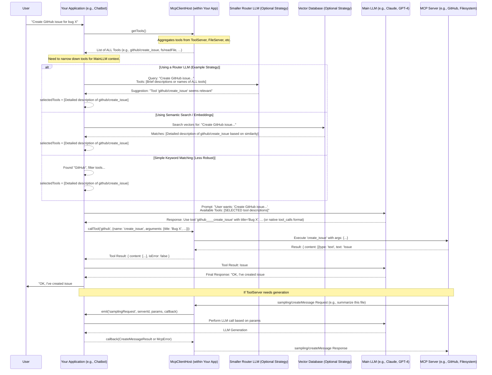

# OMCPH - Model Context Protocol | open-host-language-client

**OMCPH** provides a robust, embeddable TypeScript client host for the [Model Context Protocol (MCP)](https://modelcontextprotocol.io). It simplifies integrating external AI tools, data sources, and actions into your application (like chatbots, AI agents, or inference platforms) by managing connections to multiple MCP servers.

## Features

- **Multi-Server Management:** Connect to and manage multiple MCP servers simultaneously.
- **Multi-Transport Support:** Supports connecting via `stdio`, `sse` (Server-Sent Events), `websocket`, and `streamable-http` (MCP 2025-03-26).
- **Capability Aggregation:** Discovers and aggregates Tools, Resources, and Prompts from all connected servers into easy-to-use lists. Includes new fields like tool `annotations` and resource `size`.
- **Sampling Delegation:** Securely handles `sampling/createMessage` requests _from_ servers, delegating the actual LLM call back to your main application via events. Your application retains full control over LLM interactions and API keys.
- **Resource Update Notifications:** Supports subscribing to resource updates and emits events when resources change.
- **Event-Driven:** Emits events for server connections, disconnections, errors, capability updates, and resource updates.
- **Robust Error Handling:** Provides structured error reporting with custom error types and error aggregation.
- **Typed Interface:** Built with TypeScript for robust integration.
- **Standardized:** Based on the official `@modelcontextprotocol/sdk`.
- **Request Options:** Supports progress reporting, timeouts, and cancellation for relevant API calls.
- **Server Suggestion:** Utility methods to help determine which server is best suited to handle a specific URI, tool, or prompt.

## Core Concepts

- **MCP Host (OMCPH):** The central component within _your_ application that manages connections to MCP Servers.
- **MCP Server:** An external process or service exposing capabilities (Tools, Resources, Prompts) via the MCP protocol. OMCPH connects _to_ these.
- **MCP Client:** The underlying component (from `@modelcontextprotocol/sdk`) used by OMCPH to handle the protocol details for _each_ server connection. OMCPH manages these clients for you.
- **Your Application:** The chatbot, agent, or platform embedding OMCPH. It uses OMCPH to access server capabilities and handles delegated tasks like sampling.

**Important:** OMCPH acts as a manager and aggregator. It **does not** contain AI logic itself or decide which tools are relevant to a user's query. That intelligence resides in _your application_. The server suggestion methods are helpers for this application logic.

## Quick Start

```typescript
import {
  McpClientHost,
  McpHostConfig,
  StdioServerConfig,
  StreamableHttpServerConfig, // Import new config type
  McpError,
  ErrorCode,
  CreateMessageResult,
  RequestOptions, // Import RequestOptions
  Progress, // Import Progress type
} from "omcph";

// 1. Define Configuration
const hostConfig: McpHostConfig = {
  // Identify your application
  hostInfo: { name: "MyAwesomeChatApp", version: "1.2.0" },
  // Define capabilities your app supports (e.g., handling sampling requests)
  hostCapabilities: {
    sampling: {}, // CRITICAL: Tells servers this host can handle LLM calls
    roots: { listChanged: true }, // Example: If your app manages workspace roots
  },
  // List the MCP servers to connect to
  servers: [
    {
      id: "filesystem", // Unique ID for this server connection
      transport: "stdio",
      command: "npx", // Command to run the server
      args: [
        "-y",
        "@modelcontextprotocol/server-filesystem",
        "/Users/Shared/Documents",
      ], // Args for the command
      // cwd: "/path/to/working/dir" // Optional working directory
      // env: { "MY_VAR": "value" } // Optional environment variables
    } as StdioServerConfig, // Type assertion can help with config validation
    {
      id: "streamable-api",
      transport: "streamable-http",
      url: "http://localhost:3006/mcp", // URL for a Streamable HTTP API server
      // headers: { "X-API-Key": "your-api-key" } // Optional custom headers
    } as StreamableHttpServerConfig,
    // Add more servers (stdio, sse, websocket, streamable-http) here
  ],
};

// 2. Instantiate the Host
const host = new McpClientHost(hostConfig);

// 3. Set up Event Listeners
host.on("serverConnected", (serverId) => {
  console.log(`✅ MCP Server Connected: ${serverId}`);
});

host.on("serverDisconnected", (serverId, error) => {
  console.log(
    `🔌 MCP Server Disconnected: ${serverId}`,
    error ? `Reason: ${error.message}` : ""
  );
});

host.on("serverError", (serverId, error) => {
  console.error(` MCP Server Error [${serverId}]:`, error);
});

host.on("capabilitiesUpdated", () => {
  console.log("✨ Available MCP Capabilities Updated:");
  // Example: Update UI or internal state based on available tools
  const tools = host.getTools();
  console.log(
    `   Tools: ${tools.map((t) => `${t.serverId}/${t.name}`).join(", ")}`
  );
  // You can now access t.annotations here if needed
  // You can access resource size via host.getResources()
});

host.on("log", (level, message, data) => {
  console.log(`[OMCPH Log - ${level.toUpperCase()}] ${message}`, data || "");
});

// __* IMPORTANT: Handle Sampling Requests __*
// Your application MUST implement this listener if hostCapabilities.sampling is enabled.
host.on("samplingRequest", async (serverId, requestParams, callback) => {
  console.log(`⏳ Received sampling request from server: ${serverId}`);
  try {
    // --- YOUR LLM CALL LOGIC GOES HERE ---
    const llmApiResponse = await callYourMainLLM(requestParams);
    // --- END LLM CALL LOGIC ---

    // Map the LLM API response to the *required* CreateMessageResult structure
    const result: CreateMessageResult = {
      model: llmApiResponse.modelUsed,
      role: llmApiResponse.role,
      content: { type: "text", text: llmApiResponse.responseText },
      stopReason: llmApiResponse.stopReason,
      // usage: { ... } // Optional
    };
    console.log(`✅ Sending sampling result back to ${serverId}`);
    callback(result);
  } catch (error: any) {
    console.error(
      `❌ Error processing sampling request for ${serverId}:`,
      error
    );
    callback(
      new McpError(
        ErrorCode.InternalError,
        `LLM interaction failed: ${error.message}`
      )
    );
  }
});

// Dummy function placeholder - REPLACE THIS with your actual LLM interaction logic
async function callYourMainLLM(params: any): Promise<any> {
  console.log("Simulating LLM call with params:", params.messages);
  await new Promise((res) => setTimeout(res, 500)); // Simulate delay
  return {
    modelUsed: "simulated-llm-v1",
    role: "assistant",
    responseText: "This is the simulated LLM response.",
    stopReason: "endTurn",
  };
}

// 4. Start the Host
async function main() {
  console.log("Starting OMCPH Host...");
  await host.start();
  console.log("OMCPH Host started. Waiting for connections...");

  // 5. Use the host API (Example with RequestOptions)
  setTimeout(async () => {
    const tools = host.getTools();
    console.log(
      "\nCurrently available tools:",
      tools.length > 0 ? tools.map((t) => `${t.serverId}/${t.name}`) : "None"
    );

    const fsTool = tools.find(
      (t) => t.serverId === "filesystem" && t.name === "readFile" // Example tool
    );

    if (fsTool) {
      console.log(
        `Attempting to call ${fsTool.name} on ${fsTool.serverId} with progress...`
      );
      try {
        const options: RequestOptions = {
          timeout: 10000, // 10 second timeout
          onprogress: (progress: Progress) => {
            console.log(
              `Progress for ${fsTool.name}: ${progress.progress}% ${
                progress.message ? `- ${progress.message}` : ""
              }`
            );
          },
        };
        const result = await host.callTool(
          fsTool.serverId,
          { name: fsTool.name, arguments: { path: "some_file.txt" } }, // Adjust args as needed
          options
        );
        console.log("Tool Result:", result);
      } catch (toolError) {
        console.error("Tool call failed:", toolError);
      }
    }
  }, 5000); // Wait 5 seconds for connections

  // Add graceful shutdown
  process.on("SIGINT", async () => {
    console.log("\nShutting down OMCPH Host...");
    await host.stop();
    process.exit(0);
  });
}

main().catch(console.error);
```

## Configuration

Configure OMCPH using the `McpHostConfig` object passed to the constructor.

- **`hostInfo`**: `Implementation` object (`{ name: string, version: string }`) identifying your application.
- **`hostCapabilities`**: `ClientCapabilities` object defining what _your application_ supports (most importantly, `sampling: {}` if you handle sampling requests).
- **`servers`**: An array of `ServerConfig` objects. Each needs:
  - `id`: A unique string identifier you choose for this connection.
  - `transport`: `"stdio"`, `"sse"`, `"websocket"`, or `"streamable-http"`.
  - **For `stdio`:**
    - `command`: The executable command (e.g., `"node"`, `"python"`, `"npx"`).
    - `args`: An array of arguments for the command (e.g., `["server.js"]`).
    - `env` (optional): Environment variables `{ [key: string]: string }`.
    - `cwd` (optional): Working directory for the command. **Note:** Paths within arguments (like directory roots) are often relative to this `cwd` or must be absolute and accessible to the server process.
  - **For `sse` (Deprecated):**
    - `url`: The full URL of the Server-Sent Events endpoint.
    - `options` (optional): `SSEClientTransportOptions` from the SDK.
  - **For `websocket`:**
    - `url`: The full URL (`ws://` or `wss://`) of the WebSocket endpoint.
  - **For `streamable-http`:**
    - `url`: The full URL of the Streamable HTTP API endpoint (e.g., `http://localhost:3000/mcp`).
    - `headers` (optional): Custom HTTP headers `{ [key: string]: string }` to include with requests (e.g., for authentication).

### npx MCP Server PATH Compatibility

When using `stdio` transport with npx-based MCP servers, OMCPH addresses a critical PATH resolution issue that can prevent server launch:

**Problem:**

- npx-installed MCP servers can fail to launch due to PATH discovery limitations
- Local `node_modules/.bin` directories are not automatically included in the system PATH

**Solution:**
OMCPH dynamically modifies the PATH to ensure npx can locate and execute MCP server packages:

How OMCPH resolves the npx server launch:

1. Dynamically resolves the local `.bin` path based on the current working directory
2. Prepends this path to the existing system PATH
3. Ensures npx can correctly locate and execute MCP server packages

**Key Benefits:**

- Resolves npx package discovery issues for MCP servers
- Works transparently without additional user configuration
- Maintains existing system PATH integrity

## Error Handling

OMCPH provides a consistent error handling approach to help you identify and address issues:

### Error Types

1. **McpError**: Original errors from the `@modelcontextprotocol/sdk`. These are re-thrown directly for API methods like `callTool`, `readResource`, and `getPrompt`.

   ```typescript
   try {
     await host.callTool("server1", { name: "someTool", arguments: {} });
   } catch (error) {
     if (error instanceof McpError) {
       console.error(`MCP Protocol Error: ${error.code} - ${error.message}`);
       // Handle specific MCP error codes (see MCP specification)
     }
   }
   ```

2. **McpHostError**: Host-specific errors with custom error codes for scenarios like connection failures, configuration issues, etc.

   ```typescript
   try {
     await host.setRoots(roots);
   } catch (error) {
     if (error instanceof McpHostError) {
       console.error(`Host Error: ${error.code} - ${error.message}`);
       if (error.serverId) {
         console.error(`Failed server: ${error.serverId}`);
       }
       if (error.cause) {
         console.error(`Original cause: ${error.cause.message}`);
       }
     }
   }
   ```

3. **AggregateError**: For operations that might fail across multiple servers (like `setRoots`), an `AggregateError` contains multiple `McpHostError` instances.

   ```typescript
   try {
     await host.setRoots(roots);
   } catch (error) {
     if (error instanceof AggregateError) {
       console.error(`Multiple errors occurred (${error.errors.length}):`);
       error.errors.forEach((err, i) => {
         if (err instanceof McpHostError) {
           console.error(
             `  ${i + 1}. [${err.code}] ${err.message} (Server: ${
               err.serverId || "unknown"
             })`
           );
         }
       });
     }
   }
   ```

### Error Codes

OMCPH defines the following error codes:

| Code                   | Description                                            |
| ---------------------- | ------------------------------------------------------ |
| `ROOTS_UPDATE_FAILED`  | Failed to update workspace roots on a server           |
| `SERVER_NOT_FOUND`     | Referenced server ID doesn't exist or is not connected |
| `INVALID_TRANSPORT`    | Invalid transport type specified in configuration      |
| `CONNECTION_FAILED`    | Failed to establish connection to a server             |
| `SUBSCRIPTION_FAILED`  | Failed to subscribe to resource updates                |
| `TOOL_CALL_FAILED`     | Failed to call a tool (not from the MCP protocol)      |
| `RESOURCE_READ_FAILED` | Failed to read a resource (not from the MCP protocol)  |
| `PROMPT_GET_FAILED`    | Failed to get a prompt (not from the MCP protocol)     |

For SDK errors (McpError), refer to the [MCP Specification](https://modelcontextprotocol.io/specification/json-rpc/#error-codes) for error codes and meanings.

## API Overview

- **`start(): Promise<void>`**: Connects to all configured servers.
- **`stop(): Promise<void>`**: Disconnects from all servers.
- **`getTools(): AggregatedTool[]`**: Returns an array of all tools from connected servers. Includes optional `annotations`.
- **`getResources(): AggregatedResource[]`**: Returns an array of all concrete resources. Includes optional `size`.
- **`getResourceTemplates(): AggregatedResourceTemplate[]`**: Returns an array of all resource templates.
- **`getPrompts(): AggregatedPrompt[]`**: Returns an array of all prompts.
- **`callTool(serverId: string, params: CallToolRequest['params'], options?: RequestOptions): Promise<CallToolResult>`**: Executes a tool on a specific server. Supports `RequestOptions`.
- **`readResource(serverId: string, params: ReadResourceRequest['params'], options?: RequestOptions): Promise<ReadResourceResult>`**: Reads a resource from a specific server. Supports `RequestOptions`.
- **`getPrompt(serverId: string, params: GetPromptRequest['params'], options?: RequestOptions): Promise<GetPromptResult>`**: Gets a prompt from a specific server. Supports `RequestOptions`.
- **`setRoots(roots: Root[]): Promise<void>`**: Informs capable servers about the current workspace roots (e.g., file paths). Throws `McpHostError` or `AggregateError` on failure.
- **`getCurrentRoots(): Root[]`**: Gets the currently set roots.
- **`subscribeToResource(serverId: string, uri: string): Promise<void>`**: Subscribes to updates for a specific resource. When the resource is updated, the 'resourceUpdated' event will be emitted.
- **`unsubscribeFromResource(serverId: string, uri: string): Promise<void>`**: Unsubscribes from updates for a specific resource.
- **`getClient(serverId: string): Client | undefined`**: Gets the underlying SDK `Client` instance for advanced use.
- **`getConnectedClients(): ReadonlyMap<string, Client>`**: Gets a map of all active client connections.
- **`suggestServerForUri(uri: string): ServerSuggestion[]`**: Suggests servers that might handle a given resource URI, sorted by confidence.
- **`suggestServerForTool(toolName: string): ServerSuggestion[]`**: Suggests servers that provide a tool with the given name, sorted by confidence.
- **`suggestServerForPrompt(promptName: string): ServerSuggestion[]`**: Suggests servers that provide a prompt with the given name, sorted by confidence.

## Request Options

Methods like `callTool`, `readResource`, and `getPrompt` accept an optional `options` parameter:

```typescript
import { RequestOptions, Progress } from "omcph";

const options: RequestOptions = {
  // Timeout for the entire request in milliseconds
  timeout: 15000, // 15 seconds

  // Callback function to receive progress updates
  onprogress: (progress: Progress) => {
    console.log(`Operation Progress: ${progress.progress}%`);
    if (progress.message) {
      console.log(`  Status: ${progress.message}`);
    }
  },

  // AbortSignal for cancelling the request (e.g., from user action)
  signal: abortController.signal,

  // If true, the timeout resets each time a progress update is received
  resetTimeoutOnProgress: true,

  // Optional absolute maximum time for the request, regardless of progress
  maxTotalTimeout: 60000, // 1 minute
};

try {
  const result = await host.callTool(
    "long-server",
    { name: "longTask" },
    options
  );
} catch (error) {
  if (error.name === "AbortError") {
    console.log("Request was cancelled.");
  } else {
    console.error("Request failed:", error);
  }
}
```

- **`timeout`**: Sets a duration after which the request will fail if no response or progress is received.
- **`onprogress`**: A callback function that receives `Progress` objects (`{ progress: number, total?: number, message?: string }`) from the server during long-running operations.
- **`signal`**: An `AbortSignal` from an `AbortController`. Triggering `abortController.abort()` will attempt to cancel the request.
- **`resetTimeoutOnProgress`**: If `true`, the `timeout` timer restarts whenever an `onprogress` update is received. Defaults to `false`.
- **`maxTotalTimeout`**: An optional overall deadline for the request, even if progress is being made.

## Event Handling

Listen to events using `host.on('eventName', callback)`:

- **`serverConnected` (`serverId`, `client`)**: Fired when a server connection is successfully established and initialized.
- **`serverDisconnected` (`serverId`, `error?`)**: Fired when a server disconnects (cleanly or due to error).
- **`serverError` (`serverId`, `error`)**: Fired when an error occurs on a specific server connection.
- **`capabilitiesUpdated` ()**: Fired after connections/disconnections or when a server signals its capabilities changed. Use this to refresh your application's knowledge of available features.
- **`resourceUpdated` (`serverId`, `uri`)**: Fired when a resource is updated on a server. Only emitted for resources that have been subscribed to using `subscribeToResource`.
- **`log` (`level`, `message`, `data?`)**: Fired for internal OMCPH logs and logs forwarded from connected servers.
- **`samplingRequest` (`serverId`, `requestParams`, `callback`)**: **CRITICAL.** Fired when a server requests an LLM call. Your listener **must** perform the LLM interaction and call the `callback` function _exactly once_ with either the `CreateMessageResult` or an `McpError`.

### Handling Resource Updates (Example)

```typescript
// Subscribe to updates for a specific resource
await host.subscribeToResource("filesystem", "file:///path/to/watch.txt");

// Listen for resource update events
host.on("resourceUpdated", async (serverId, uri) => {
  // Make listener async
  console.log(`🔄 Resource updated: ${uri} on server ${serverId}`);
  // Fetch the updated resource content if needed
  try {
    const result = await host.readResource(serverId, { uri });
    // Assuming result.contents is an array and we want the first text content
    const content = result.contents?.find((c) => c.type === "text")?.text;
    console.log("Updated content:", content);
    // Take action based on the updated content
    // processResourceUpdate(content);
  } catch (err) {
    console.error("Error reading updated resource:", err);
  }
});

// Later, when you no longer need updates
await host.unsubscribeFromResource("filesystem", "file:///path/to/watch.txt");
```

### Handling `samplingRequest` (Example Detail)

```typescript
import { McpError, ErrorCode, CreateMessageResult, TextContent } from "omcph"; // or @modelcontextprotocol/sdk/types

host.on("samplingRequest", async (serverId, requestParams, callback) => {
  console.log(`Processing sampling request from ${serverId}...`);
  try {
    // 1. Use requestParams (messages, systemPrompt, modelPreferences, etc.)
    //    to make a call to your primary LLM API (e.g., Anthropic API, OpenAI API)
    const llmResponse = await yourAppsLlmApi.generate(requestParams); // Adapt this call

    // Example structure returned by yourAppsLlmApi.generate:
    // const llmResponse = {
    //   modelName: "claude-3-opus-20240229",
    //   role: "assistant",
    //   text: "Here's the generated response.",
    //   stopReason: "end_turn",
    //   usage: { input_tokens: 50, output_tokens: 100 }
    // };

    // 2. Map the response from your LLM API to the *required* MCP CreateMessageResult format
    const mcpResult: CreateMessageResult = {
      model: llmResponse.modelName, // *Required: The specific model used
      role: llmResponse.role, // *Required: Must be 'assistant'
      content: {
        // *Required: Must be TextContent or ImageContent or AudioContent
        type: "text",
        text: llmResponse.text,
      } as TextContent, // Cast appropriately based on actual content
      stopReason: llmResponse.stopReason, // *Required: e.g., 'endTurn', 'maxTokens', 'toolUse'
      usage: llmResponse.usage
        ? {
            // Optional: Map token usage if available
            promptTokens: llmResponse.usage.input_tokens,
            completionTokens: llmResponse.usage.output_tokens,
            totalTokens:
              llmResponse.usage.input_tokens + llmResponse.usage.output_tokens,
          }
        : undefined,
      // stopSequence: undefined, // Optional
      // toolCalls: undefined, // Optional
    };

    // 3. Call the callback *exactly once* with the successful result
    callback(mcpResult);
  } catch (error: any) {
    console.error("LLM call failed during sampling:", error);
    // 4. If the LLM call fails, call the callback *exactly once* with an McpError
    callback(
      new McpError(
        ErrorCode.InternalError, // Or a more specific code like InvalidRequest (-32600) if applicable
        `LLM API Error: ${error.message}`
      )
    );
  }
});
```

## Simplified Sampling Handler

OMCPH provides a simplified way to handle sampling requests from MCP servers:

```typescript
import { McpClientHost, McpError, ErrorCode } from "omcph";

// Create and configure the host as shown above...
const host = new McpClientHost(config);

// Use the simplified sampling handler
host.setSamplingHandler(async (serverId, params) => {
  try {
    // Just implement your core LLM call logic - no need to worry about
    // formatting the response in the MCP protocol format
    const llmResponse = await myLlmService.generateText(params.messages);

    // Return a simple object with just the content and optional metadata
    return {
      content: llmResponse,
      model: "my-model-name", // optional
      usage: {
        promptTokens: 150, // optional
        completionTokens: 50, // optional
      },
    };
  } catch (error) {
    // You can return an McpError...
    return new McpError(ErrorCode.InternalError, `LLM error: ${error.message}`);

    // ...or just throw and let OMCPH handle the error wrapping
    // throw error;
  }
});

// Start the host as usual
await host.start();
```

## Server Suggestion Methods

OMCPH provides helper methods to suggest which server can handle a specific tool, resource, or prompt. This is useful when multiple servers might offer similar capabilities.

```typescript
import { ServerSuggestion } from "omcph";

// Suggest servers for a resource URI
const resourceSuggestions: ServerSuggestion[] = host.suggestServerForUri(
  "file:///path/to/file.txt"
);
if (resourceSuggestions.length > 0) {
  const bestMatch = resourceSuggestions[0]; // Suggestions are sorted by confidence
  console.log(
    `Best server for URI: ${bestMatch.serverId} (Type: ${bestMatch.matchType}, Confidence: ${bestMatch.confidence})`
  );
  // Use the suggested server
  // const result = await host.readResource(bestMatch.serverId, { uri: "file:///path/to/file.txt" });
}

// Suggest servers for a tool
const toolSuggestions: ServerSuggestion[] =
  host.suggestServerForTool("readFile");
if (toolSuggestions.length > 0) {
  const bestToolServerId = toolSuggestions[0].serverId;
  console.log(`Best server for tool 'readFile': ${bestToolServerId}`);
  // Use the suggested server
  // const result = await host.callTool(bestToolServerId, { name: "readFile", arguments: { path: "/path/to/file.txt" } });
}

// Suggest servers for a prompt
const promptSuggestions: ServerSuggestion[] =
  host.suggestServerForPrompt("greetingPrompt");
if (promptSuggestions.length > 0) {
  const bestPromptServerId = promptSuggestions[0].serverId;
  console.log(`Best server for prompt 'greetingPrompt': ${bestPromptServerId}`);
  // Use the suggested server
  // const result = await host.getPrompt(bestPromptServerId, { name: "greetingPrompt", arguments: { name: "John" } });
}
```

The suggestion methods return an array of `ServerSuggestion` objects, sorted by confidence (highest first). Each suggestion includes:

- `serverId`: The ID of the suggested server.
- `confidence`: A number between 0.0 and 1.0 indicating the match quality (1.0 = exact match).
- `matchType`: The type of match found (`"exact"`, `"template"`, `"scheme"` for URIs; `"name"` for tools/prompts).

## Running the API Server

You can run the API server as a standalone executable with configuration via file and environment variables:

```bash
# Most convenient way - using npx
npx omcph-api-server

# With configuration via environment variables
OMCPH_API_PORT=3001 OMCPH_API_KEYS=my-secret-key npx omcph-api-server

# Install globally
npm install -g omcph

# Run after global installation
omcph-api-server

# Run with a config file
OMCPH_CONFIG_PATH=./config.json omcph-api-server
```

Create a configuration file (e.g., `config.json`):

```json
{
  "hostInfo": {
    "name": "OMCPH API Host",
    "version": "0.1.0"
  },
  "hostCapabilities": {
    "sampling": {},
    "roots": { "listChanged": true }
  },
  "servers": [
    {
      "id": "filesystem",
      "name": "Filesystem Server",
      "transport": "stdio",
      "command": "npx",
      "args": [
        "-y",
        "@modelcontextprotocol/server-filesystem",
        "/path/to/files"
      ]
    },
    {
      "id": "tools",
      "name": "Tools Server",
      "transport": "websocket",
      "url": "ws://localhost:3001/mcp"
    }
  ]
}
```

Environment variables (can be set in a `.env` file):

```
# API Server Configuration
OMCPH_API_PORT=3000

# Path to the configuration file
OMCPH_CONFIG_PATH=./config.json

# API Key Authentication (comma-separated list of keys)
OMCPH_API_KEYS=your-api-key-1,your-api-key-2

# Set to "false" to disable authentication even if API keys are provided
# OMCPH_AUTH_REQUIRED=false
```

## Tool/Context Selection Strategy

OMCPH provides the _full list_ of tools, resources, etc., from all connected servers via methods like `getTools()`.

**Your application is responsible for selecting which of these capabilities are relevant** to the current user query _before_ constructing the prompt for your main LLM. Sending descriptions of _all_ capabilities is usually not feasible due to context window limitations and cost.

Common strategies (implement these in _your_ application logic):

1.  **Keyword Matching:** Simple filtering based on terms in the user query and tool descriptions. Often too brittle.
2.  **Router LLM:** Use a smaller, faster LLM call specifically designed to analyze the user query and the available tools/servers, outputting which one(s) seem most relevant. (See the `example/chatbot` for an implementation of this).
3.  **Semantic Search/Embeddings:** Pre-compute embeddings (vector representations) for tool/resource descriptions. Convert the user query into an embedding and perform a vector search to find the most semantically similar capabilities.
4.  **Hardcoded Logic:** For simpler applications, you might have specific logic (e.g., `if query contains "calculate" use calculator tool`).

The chosen strategy significantly impacts the effectiveness and efficiency of tool usage in your application.

## Example Application Flow Diagram



## Conceptual Typescript Example

```typescript
import {
  McpClientHost,
  McpHostConfig,
  CreateMessageResult,
  McpError,
  ErrorCode,
  Root,
  CreateMessageRequest,
  RequestOptions, // Import RequestOptions
  Progress, // Import Progress
} from "omcph";

async function runExample() {
  const hostConfig: McpHostConfig = {
    hostInfo: { name: "MyChatApp", version: "1.0.0" },
    hostCapabilities: {
      // Indicate that our chat app *can* handle sampling requests
      sampling: {},
      roots: { listChanged: true }, // Indicate we can send root updates
    },
    servers: [
      {
        id: "filesystem",
        transport: "stdio",
        command: "npx",
        args: [
          "-y",
          "@modelcontextprotocol/server-filesystem",
          "/path/to/user/docs",
        ],
        // Optional: Specify environment variables if needed
        // env: { "SOME_VAR": "some_value" },
        // Optional: Specify working directory if needed
        // cwd: "/path/to/user"
      },
      {
        id: "calculator",
        transport: "stdio",
        command: "python",
        args: ["./path/to/calculator_server.py"], // Assuming a simple python server script
      },
      // {
      //     id: "remote-weather",
      //     transport: "sse",
      //     url: "http://localhost:3001/sse" // Example SSE server URL
      // }
    ],
  };

  const host = new McpClientHost(hostConfig);

  // --- Event Handling ---
  host.on("serverConnected", (serverId, client) => {
    console.log(`✨ Server connected: ${serverId}`);
    // You could potentially adjust logging level per server here if needed
    // client.setLoggingLevel('debug').catch(e => console.error(`Failed to set log level for ${serverId}`, e));
  });

  host.on("serverDisconnected", (serverId, error) => {
    console.log(
      `🔌 Server disconnected: ${serverId}`,
      error ? `Error: ${error.message}` : ""
    );
  });

  host.on("serverError", (serverId, error) => {
    console.error(`❗ Error from server ${serverId}:`, error);
  });

  host.on("capabilitiesUpdated", () => {
    console.log("🚀 Host capabilities updated!");
    console.log(
      "Available Tools:",
      host.getTools().map((t) => `${t.serverId}/${t.name}`)
    );
    console.log(
      "Available Resources:",
      host.getResources().map((r) => `${r.serverId}/${r.uri}`)
    );
    console.log(
      "Available Prompts:",
      host.getPrompts().map((p) => `${p.serverId}/${p.name}`)
    );
  });

  host.on("log", (level, message, data) => {
    console.log(`[Host Log - ${level.toUpperCase()}] ${message}`, data || "");
  });

  // --- Sampling Request Handling ---
  // This is where you integrate with your LLM API call logic.
  // It MUST call the callback exactly once.
  host.on("samplingRequest", async (serverId, requestParams, callback) => {
    console.log(`Received sampling request from server: ${serverId}`);
    console.log("Sampling Params:", requestParams);
    try {
      // Replace with your actual LLM API call
      const llmResponse = await callYourLlmApi(requestParams);
      // llmResponse structure (example):
      // { modelUsed: "...", role: "assistant", content: "...", stopReason: "..." }
      console.log(`LLM response received for ${serverId}`);

      // Map your LLM response to the REQUIRED CreateMessageResult format
      const result: CreateMessageResult = {
        model: llmResponse.modelUsed, // *Required
        role: llmResponse.role, // *Required (must be 'assistant')
        content: { type: "text", text: llmResponse.content }, // *Required (Text or Image)
        stopReason: llmResponse.stopReason, // *Required
        // usage: llmResponse.usage // Optional
      };
      // Send success result back to the server via the host
      callback(result);
    } catch (error: any) {
      console.error(`Error handling sampling request for ${serverId}:`, error);
      // Send error back to the server via the host
      callback(
        new McpError(
          ErrorCode.InternalError, // Or more specific code
          `LLM interaction failed: ${error.message}`
        )
      );
    }
  });

  // Start the host
  await host.start();

  // Example: Setting initial roots (e.g., user's project directory)
  const initialRoots: Root[] = [
    { uri: "file:///path/to/user/project", name: "Current Project" },
  ];
  try {
    await host.setRoots(initialRoots);
    console.log("Successfully set initial roots.");
  } catch (rootError) {
    console.error("Failed to set initial roots:", rootError);
  }

  // --- Example Interaction ---
  // Wait a bit for connections and capabilities to settle
  await new Promise((resolve) => setTimeout(resolve, 2000));

  const tools = host.getTools();
  const calculatorTool = tools.find(
    (t) => t.serverId === "calculator" && t.name === "add"
  );

  if (calculatorTool) {
    console.log("\nCalling calculator tool 'add'...");
    try {
      const result = await host.callTool("calculator", {
        name: "add",
        arguments: { a: 5, b: 7 },
      });
      // Assuming calculator returns result in content[0].text
      const resultText =
        result.content && result.content[0]?.type === "text"
          ? result.content[0].text
          : "[No text content]";
      console.log("Calculator Result:", resultText);
    } catch (error) {
      console.error("Error calling calculator tool:", error);
    }
  } else {
    console.log("Calculator tool 'add' not found.");
  }

  const fsTools = host.getTools().filter((t) => t.serverId === "filesystem");
  const readFileTool = fsTools.find((t) => t.name === "readFile");
  if (readFileTool) {
    console.log("\nCalling filesystem tool 'readFile' with progress...");
    try {
      // IMPORTANT: This path *must* be accessible by the filesystem MCP server process,
      // relative to its configuration (root directory or cwd) or as an absolute path.
      // The path "/path/to/user/docs/my_document.txt" corresponds to the server's
      // root directory specified in hostConfig.servers.
      const filePath = "my_document.txt"; // Path relative to the server's root
      console.log(
        `Attempting to read: ${filePath} (relative to server root /path/to/user/docs)`
      );

      // Define options with onprogress
      const options: RequestOptions = {
        onprogress: (progress: Progress) => {
          console.log(
            `Read progress: ${progress.progress}% ${
              progress.message ? `- ${progress.message}` : ""
            }`
          );
        },
        timeout: 5000, // Example timeout
      };

      const result = await host.callTool(
        "filesystem",
        {
          name: "readFile",
          arguments: { path: filePath }, // Provide the path the server expects
        },
        options // Pass options here
      );
      const fileContent =
        result.content && result.content[0]?.type === "text"
          ? result.content[0].text
          : "[No text content]";
      console.log(
        `Content of ${filePath}:`,
        fileContent.substring(0, 100) + "..."
      );
    } catch (error) {
      console.error("Error calling filesystem tool:", error);
    }
  }

  // --- Cleanup ---
  console.log("\nRunning for 10 seconds before stopping...");
  await new Promise((resolve) => setTimeout(resolve, 10000));
  await host.stop();
  console.log("Host stopped.");
}

// Dummy function for example - REPLACE with your actual LLM API call logic
// This MUST return a structure that can be mapped to CreateMessageResult.
async function callYourLlmApi(params: CreateMessageRequest["params"]): Promise<{
  modelUsed: string;
  role: "assistant";
  content: string; // The raw text response
  stopReason: string; // e.g., 'endTurn', 'maxTokens'
  usage?: any; // Optional usage stats
}> {
  console.log("--- SIMULATING LLM API CALL ---");
  console.log("Messages:", params.messages);
  console.log("System Prompt:", params.systemPrompt);
  console.log("Model Prefs:", params.modelPreferences);
  // Simulate network delay
  await new Promise((res) => setTimeout(res, 500));
  console.log("--- SIMULATION COMPLETE ---");
  // Return a dummy response structure matching the expected fields
  return {
    modelUsed: "simulated-model-v1",
    role: "assistant",
    content: "This is a simulated response to the sampling request.",
    stopReason: "endTurn",
  };
}

// runExample().catch(console.error);
```

## Resource URI Resolution

When working with multiple MCP servers, determining which server handles a specific resource URI can be challenging. OMCPH provides a flexible utility to help resolve server IDs for a given URI.

### URI Resolution Strategies

The `resolveResourceServer` utility and `suggestServerForUri` method use a multi-step approach to find the most appropriate server for a resource URI:

1. **Exact URI Match** (Highest Confidence)

   - Checks if the URI exactly matches a known resource URI
   - Returns the server ID with 100% confidence if found

2. **Resource Template Match** (Medium Confidence)

   - Checks if the URI matches any registered resource templates
   - Returns the server ID with 80% confidence if a template match is found

3. **URI Scheme Match** (Lowest Confidence)
   - Checks if the URI scheme (e.g., `file:`, `http:`) matches any known resource schemes
   - Returns matching server IDs with 50% confidence

### Usage Examples

#### Basic Usage

```typescript
import { McpClientHost, resolveResourceServer } from "omcph";

// Create your MCP host
const host = new McpClientHost(config);

// Option 1: Using the standalone utility function
const serverMatches = resolveResourceServer(
  "file:///path/to/document.txt",
  host
);

if (serverMatches.length > 0) {
  const bestMatch = serverMatches[0];
  console.log(
    `Best server: ${bestMatch.serverId} (Match type: ${bestMatch.matchType})`
  );

  // Use the server ID to read the resource
  const result = await host.readResource(bestMatch.serverId, {
    uri: "file:///path/to/document.txt",
  });
}

// Option 2: Using the extension method on McpClientHost
const suggestedServers = host.suggestServerForUri(
  "file:///path/to/document.txt"
);
```

#### Handling Multiple Matches

```typescript
const serverMatches = resolveResourceServer(
  "file:///dynamic/document.txt",
  host
);

// Iterate through potential servers
for (const match of serverMatches) {
  try {
    const result = await host.readResource(match.serverId, {
      uri: "file:///dynamic/document.txt",
    });
    // Successfully read the resource
    break;
  } catch (error) {
    // Try the next server if reading fails
    continue;
  }
}
```

### Customization and Limitations

- The utility uses a simplified template matching approach. You may need to enhance the `canMatchTemplate` function for complex URI templates.
- The confidence levels are heuristic and may not perfectly match your specific use case.
- Always validate the returned server IDs against your application's specific requirements.

### Best Practices

1. Register clear and distinct resource URIs and templates for each server.
2. Use unique URI schemes when possible to simplify resolution.
3. Implement fallback logic when multiple servers are suggested.

### Performance Considerations

The utility performs in-memory matching and is designed to be fast. However, for very large numbers of resources and templates, you might want to implement more optimized matching strategies.

## Resource Subscription Management

The OMCPH library supports real-time updates for resources through a subscription system. This allows your application to be notified when resources change, enabling dynamic data monitoring and reactive UI updates.

### Implementation Overview

Resource subscription management in OMCPH includes:

1. **Subscribe to resources**: Register interest in a resource to receive notifications when it changes
2. **Resource update events**: Receive events when subscribed resources are modified
3. **Unsubscribe from resources**: Remove subscription when updates are no longer needed

### Example Usage

Here's a complete example showing the subscription lifecycle:

```typescript
import { McpClientHost, McpHostConfig, McpHostError, ErrorCodes } from "omcph";

// Create and configure the host
const host = new McpClientHost(config);

// Start the host and connect to servers
await host.start();

async function monitorResourceExample() {
  // 1. Set up event listener for resource updates
  host.on("resourceUpdated", async (serverId, uri) => {
    // Make listener async
    console.log(`🔄 Resource updated: ${uri} on server ${serverId}`);

    // Fetch the updated resource content
    try {
      const result = await host.readResource(serverId, { uri });
      // Assuming result.contents is an array and we want the first text content
      const content = result.contents?.find((c) => c.type === "text")?.text;
      console.log("Updated content:", content);

      // Take action based on the updated content
      // For example: update UI, trigger business logic, etc.
      // processResourceUpdate(content);
    } catch (error) {
      console.error(`Failed to read updated resource ${uri}:`, error);
    }
  });

  // 2. Subscribe to a specific resource
  try {
    const resourceUri = "git://repo/main/config.json"; // Example URI
    const serverId = "git-server"; // Example server ID

    // Ensure server is connected before subscribing (optional but good practice)
    if (!host.getClient(serverId)) {
      console.warn(`Server ${serverId} not connected. Cannot subscribe yet.`);
      // Optionally wait for connection or handle differently
      return;
    }

    await host.subscribeToResource(serverId, resourceUri);
    console.log(`✅ Successfully subscribed to ${resourceUri}`);

    // Resource is now being monitored - updates will trigger the event handler

    // 3. Later, when no longer needed, unsubscribe
    // For example, after a timeout or user action
    setTimeout(async () => {
      try {
        await host.unsubscribeFromResource(serverId, resourceUri);
        console.log(`✅ Successfully unsubscribed from ${resourceUri}`);
      } catch (error) {
        console.error(`Failed to unsubscribe from ${resourceUri}:`, error);
      }
    }, 60000); // Unsubscribe after 1 minute
  } catch (error) {
    console.error("Subscription error:", error);
  }
}

// Helper function placeholder
// function processResourceUpdate(content: string | undefined) {
//   // Custom logic for handling resource changes
//   // ...
// }

// Call the example function
// monitorResourceExample();
```

### Common Use Cases

Resource subscriptions are particularly useful for:

1. **Live configuration monitoring**: Get notified when configuration files change
2. **Real-time collaborative editing**: Track changes to shared resources
3. **Data synchronization**: Keep local data in sync with server resources
4. **Reactive UI updates**: Update user interfaces in response to resource changes
5. **Event-driven workflows**: Trigger processes when specific resources are modified

### Best Practices

When implementing resource subscriptions:

1. **Be selective with subscriptions**: Only subscribe to resources you actually need to monitor to avoid unnecessary network traffic and processing
2. **Handle errors gracefully**: Both subscription and unsubscription operations can fail - implement proper error handling
3. **Manage subscription lifecycle**: Unsubscribe when the resource is no longer needed or when your component unmounts
4. **Consider debouncing**: If a resource might change rapidly, consider debouncing your response to avoid excessive processing
5. **Verify server support**: Not all servers support resource subscriptions - check server capabilities first (`client.getServerCapabilities().resources?.subscribe === true`).

### API Reference

#### `subscribeToResource(serverId: string, uri: string): Promise<void>`

Subscribe to updates for a specific resource.

- **Parameters**:
  - `serverId`: The ID of the server hosting the resource
  - `uri`: The URI of the resource to subscribe to
- **Returns**: A promise that resolves when the subscription is complete
- **Throws**: `McpHostError` if the server is not found or the subscription fails

#### `unsubscribeFromResource(serverId: string, uri: string): Promise<void>`

Unsubscribe from updates for a specific resource.

- **Parameters**:
  - `serverId`: The ID of the server hosting the resource
  - `uri`: The URI of the resource to unsubscribe from
- **Returns**: A promise that resolves when the unsubscription is complete
- **Throws**: `McpHostError` if the server is not found or the unsubscription fails

#### Event: `resourceUpdated`

Emitted when a subscribed resource is updated.

- **Event Arguments**:
  - `serverId`: The ID of the server hosting the resource
  - `uri`: The URI of the resource that was updated

### Error Handling

Common errors you might encounter:

```typescript
try {
  await host.subscribeToResource(serverId, resourceUri);
} catch (error) {
  if (error instanceof McpHostError) {
    switch (error.code) {
      case ErrorCodes.SERVER_NOT_FOUND:
        console.error(`Server ${serverId} not found or not connected`);
        break;
      case ErrorCodes.SUBSCRIPTION_FAILED:
        console.error(
          `Failed to subscribe to ${resourceUri}: ${error.message}`
        );
        break;
      default:
        console.error(`Unexpected error: ${error.message}`);
    }

    if (error.cause) {
      console.error("Original cause:", error.cause);
    }
  } else {
    console.error("Unknown error:", error);
  }
}
```
